# cashflow
## Веб-приложение для управления финансами.
### Установка и запуск
1. Клонировать репозиторий:
   ```
   git clone https://github.com/malbmarty/cashflow.git
   cd cashflow
2. Создать и активировать вирутальное окружение:
    ```
    python -m venv venv
    source venv/bin/activate       # Linux / macOS
    venv\Scripts\activate          # Windows
3. Установить зависимости:
    ```
    pip install -r requirements.txt
4. Применить миграции и загрузить данные в базу:
    ```
    python manage.py migrate
    python manage.py loaddata initial_data.json
5. Запустить сервер:
    ```
    python manage.py runserver
    ```
    После этого проект будет доступен по адресу:
    http://127.0.0.1:8000/ (главная страница)
### Другие страницы:
    http://127.0.0.1:8000/create. - создание записи
    http://127.0.0.1:8000/edit/<int:pk>/ - редактирование записи
    http://127.0.0.1:8000/manage/ - управление справочниками
### API:
    Для статусов: http://127.0.0.1:8000/api/statuses/
    Для типов: http://127.0.0.1:8000/api/types/
    Для категорий: http://127.0.0.1:8000/api/categories/
    Для подкатегорий: http://127.0.0.1:8000/api/subcategories/
    Для транзакций: http://127.0.0.1:8000/api/transactions/

### Скриншоты интерфейса
Главная страница:
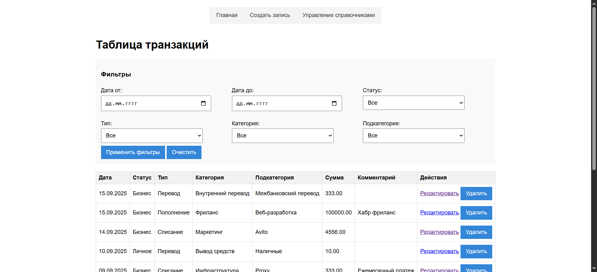
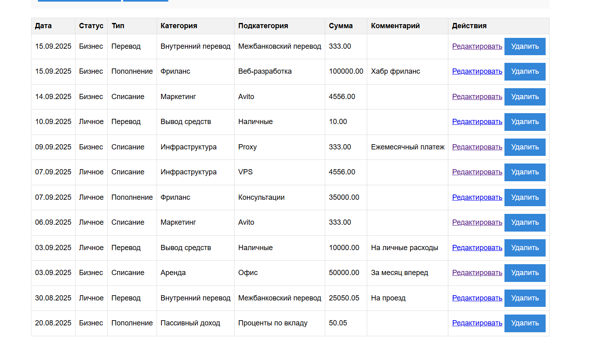

Фильтрация по дате:
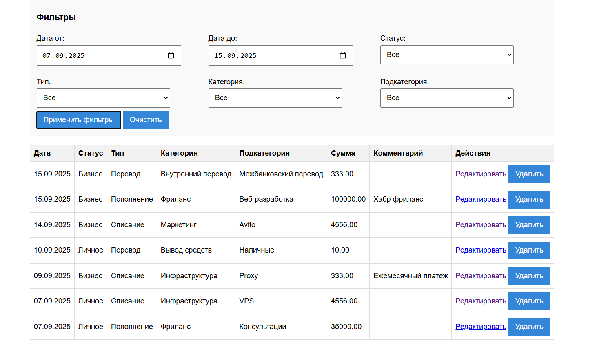

Фильтрация по дате и статусу:
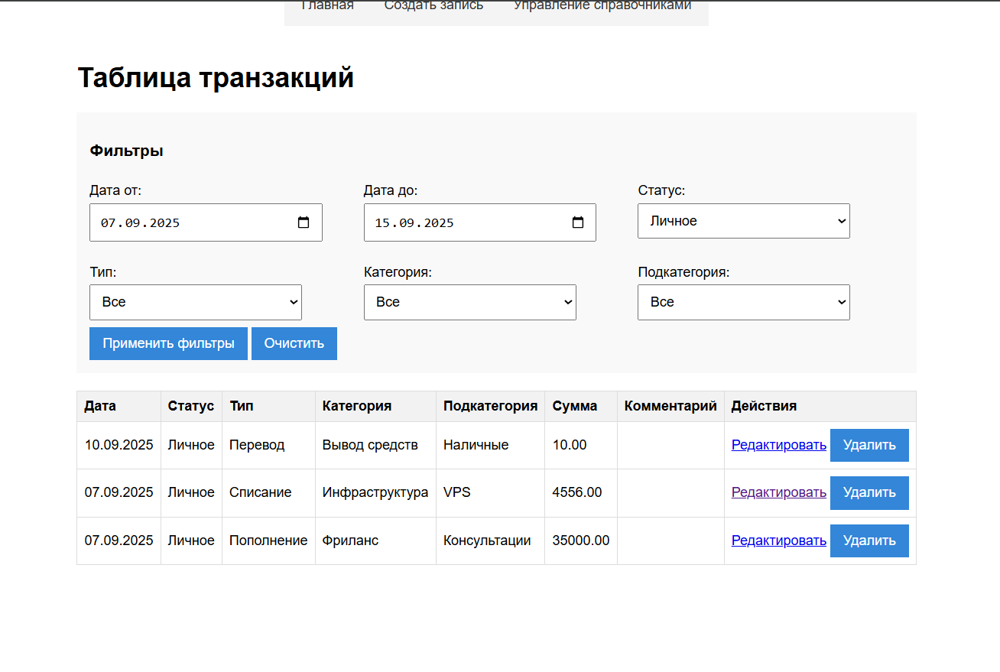

Фильтрация по дате и типу:
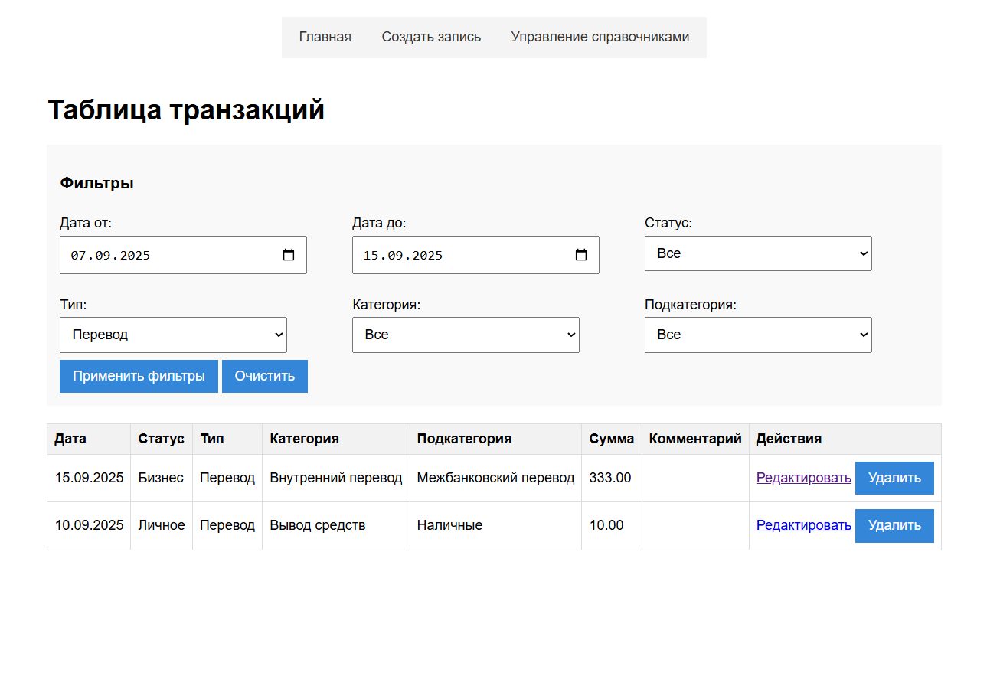

Фильтрация по дате и категории:
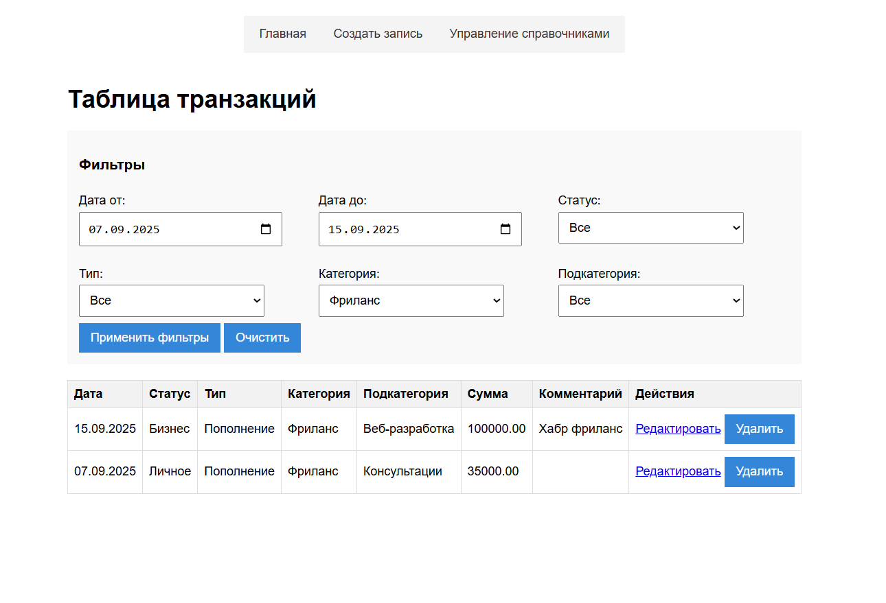

Фильтрация по дате и подкатегории:
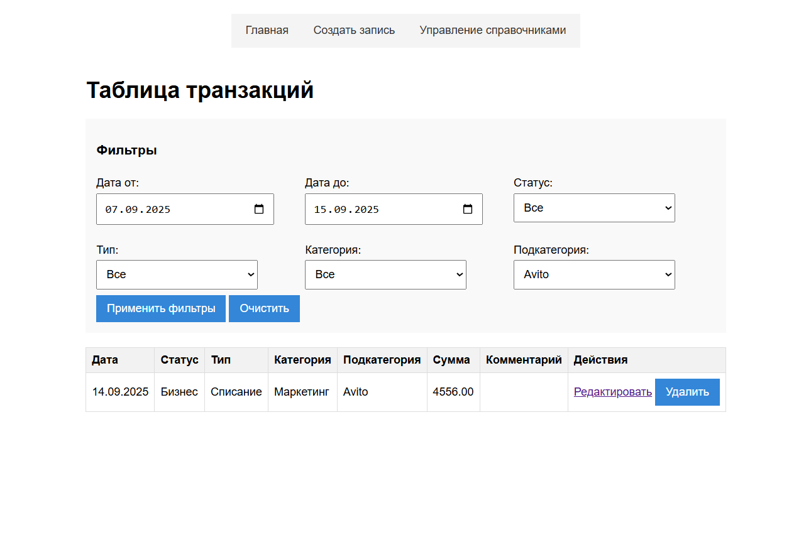

Создание записи:
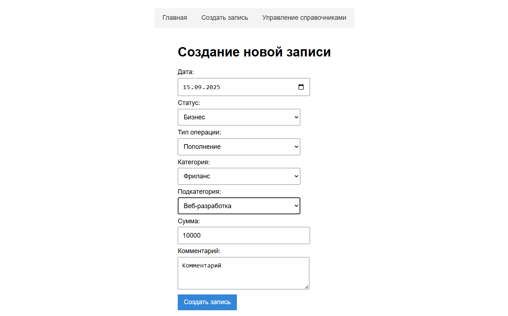

Редактирование записи: 
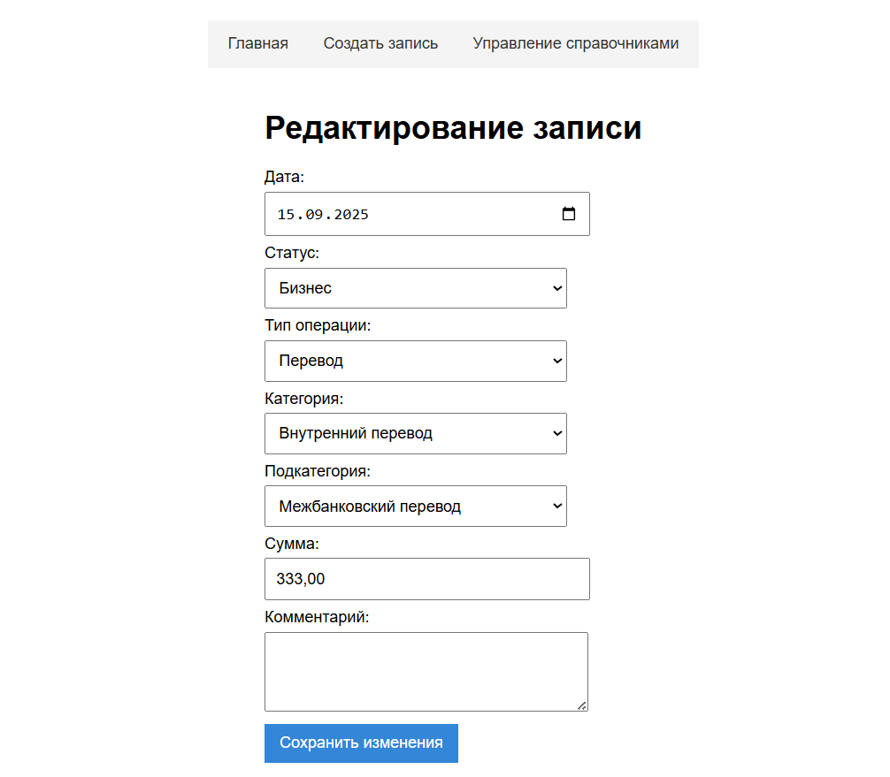

Управление справочниками: 
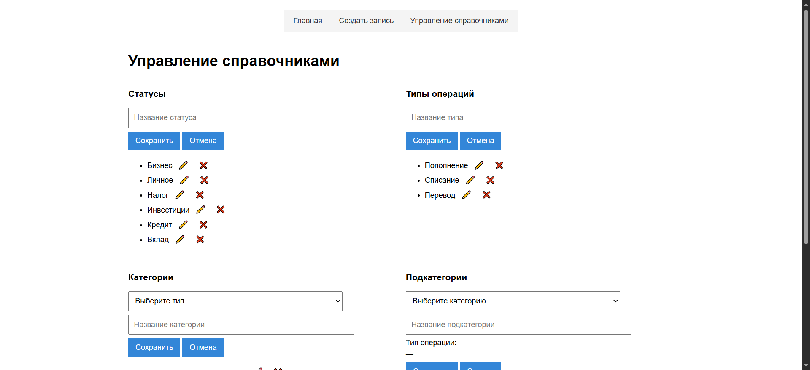
(продолжение)
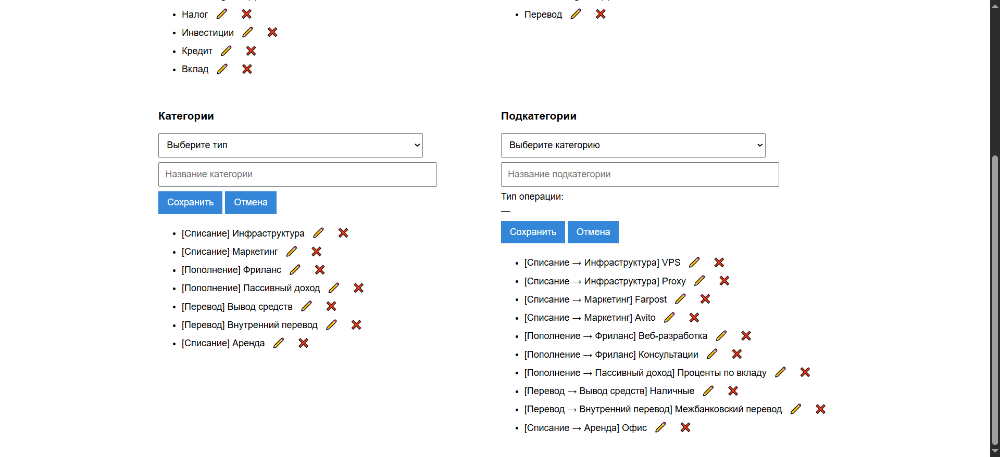